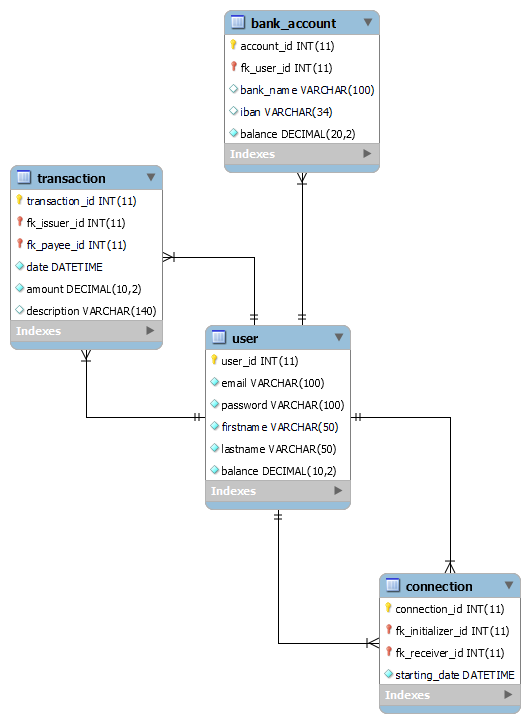
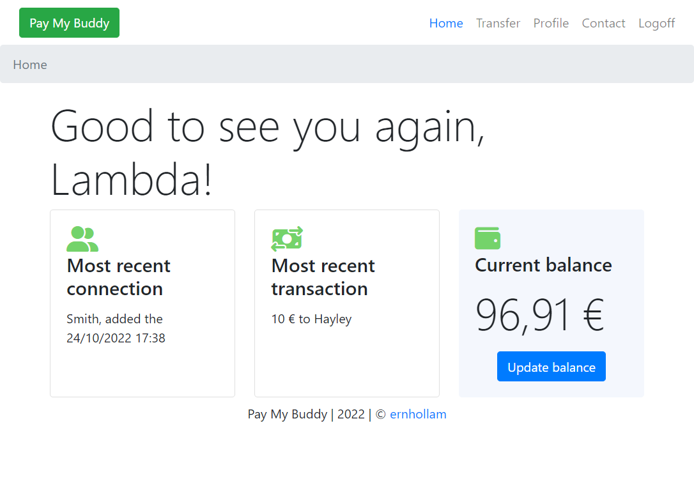
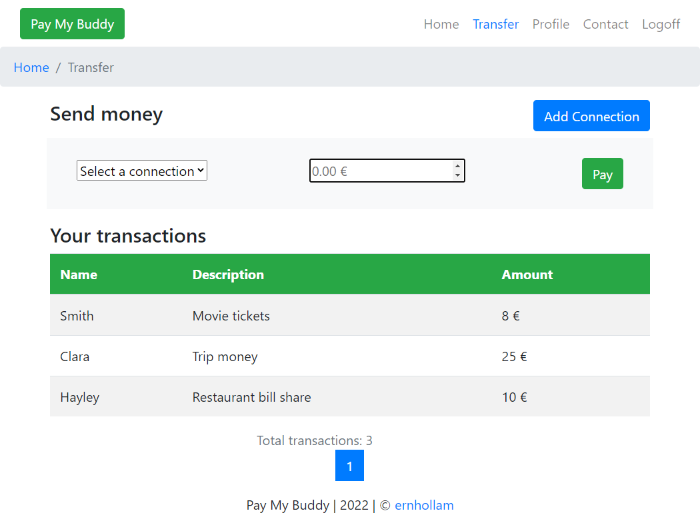

# PayMyBuddy
6th project from OpenClassrooms' Backend developer curriculum, an app for money transfer between friends.

## Summary

You are looking for an app that makes money transfer between friends? Say no more, you stumbled on the right application.

With PayMyBuddy, you will be able to:
- create an account,
- deposit or withdraw money at any time, from your bank account to your PayMyBuddy account,
- add new connections with only their email address and,
- transfer money to your dearest friends!

## Disclaimer after the defense
### With or without a bank account?
After the defense, some changes have been made for the DAL layer, it was asked to add the bank account in the entities.
The application worked fine without a bank account entity. `deposit()` and `withdraw()` were the methods which could perform the feature stated by "_At any time, users can transfer the money to their bank account_".

However, this is how the app works with the bank account:
- a user can have only one bank account (for simplicity reasons)
- when depositing or withdrawing money, the amount is either added or subtracted from the bank account's balance.

To add the bank account in the app, it is assumed that the app has access to a bank account's balance, which might not be possible in real life. Therefore, the app is still improvable regarding the bank account management.

### Improvements made
The defense still helped to improve the app's robustness, the latest changes are:
- checking that the given IDs are not null before any operation
- adding the foreign keys as primary keys in `transaction`, `connection` and `bank_account`tables, making the relations identifying relations. This prevents users to add the same connection or transaction more than once in the database (for connections, a check is already done in ConnectionService)
- in `data.sql`, as the IDs are auto-incremented, there is no need to create the ID
- UML diagram and physical data model are now with bank account,
- unit tests and integration tests have been added to handle the changes due to bank account


Last but not least:
- only the repository and service layers have been added to handle the bank account. As there is no controller layer, the user must add a bank account directly in the database to make the application work properly.


## Getting started

### What you need
- Java JDK 17.0.1
- SpringBoot 2.7.1
- Spring Security 5.7.2
- Maven 3.8.4
- Thymeleaf
- Bootstrap v.4.3.1

### Running PayMyBuddy
Clone the source repository using Git:

```git clone https://github.com/ernhollam/PayMyBuddy.git```

Open your favorite IDE, clone, and run `PayMyBuddyApplication.java` to launch the application.


## DAL layer
### UML diagram


### Physical data model


### Database
To create the database, open your favorite SGBD and run the script under [src/main/resources/database/create.sql](src/main/resources/database/create.sql).

Once your database is created, you can populate it by running [src/main/resources/database/data.sql](src/main/resources/database/data.sql) or by running the app, then creating your own users to test the app.


## Glimpses
We know, this is exciting! If you want to catch a glimpse at how PayMyBuddy looks, here are some shots of the most used pages!

Of course, to begin with, one must log in to appreciate all PayMyBuddy's features:


Once you are logged in, you are very well welcomed.


Want to add a connection, see last transactions or pay a buddy, the transfer page is here for you:

